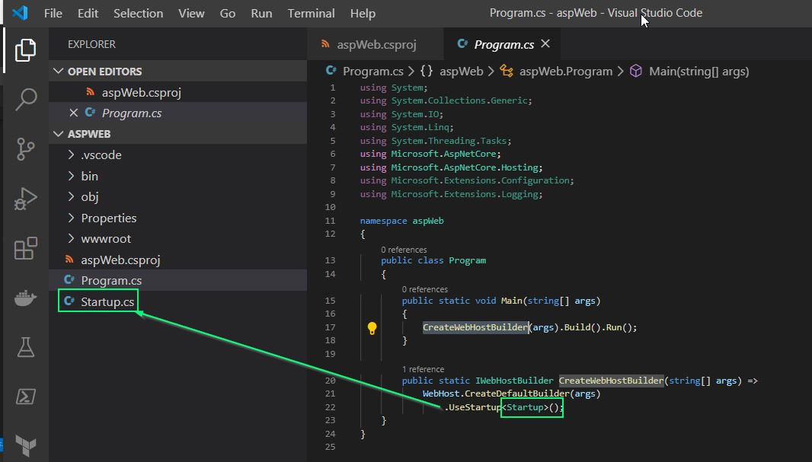

# Asp web

utilsation de IIS expres.


````bashC:\PERSONNEL\dot_net_training\aspWeb
        λ dotnet new web
        Le modèle 'ASP.NET Core Empty' a été créé.
        
        Traitement des actions postcréation...
        Exécution de 'dotnet restore' sur C:\PERSONNEL\dot_net_training\aspWeb\aspWeb.csproj...
          Restauration des packages pour C:\PERSONNEL\dot_net_training\aspWeb\aspWeb.csproj...
          Génération du fichier MSBuild C:\PERSONNEL\dot_net_training\aspWeb\obj\aspWeb.csproj.nuget.g.props.
          Génération du fichier MSBuild C:\PERSONNEL\dot_net_training\aspWeb\obj\aspWeb.csproj.nuget.g.targets.
          Restauration effectuée dans 2,26 sec pour C:\PERSONNEL\dot_net_training\aspWeb\aspWeb.csproj.
        
        Restauration réussie.
        
        
        C:\PERSONNEL\dot_net_training\aspWeb
        λ dir
         Le volume dans le lecteur C s’appelle OS
         Le numéro de série du volume est 2E66-D7B4
        
         Répertoire de C:\PERSONNEL\dot_net_training\aspWeb
        
        13/04/2020  20:22    <DIR>          .
        13/04/2020  20:22    <DIR>          ..
        13/04/2020  20:22               310 aspWeb.csproj
        13/04/2020  20:22    <DIR>          obj
        13/04/2020  20:22               628 Program.cs
        13/04/2020  20:22    <DIR>          Properties
        13/04/2020  20:22             1 116 Startup.cs
        13/04/2020  20:22    <DIR>          wwwroot
                       3 fichier(s)            2 054 octets
                       5 Rép(s)  18 552 700 928 octets libres
        
        C:\PERSONNEL\dot_net_training\aspWeb
        
 ````    
Vérifier le contenu du repertoire du projet
````bash
````


Generation d'un certificat auto-signé pour l'application
````bash
C:\PERSONNEL\dot_net_training\aspWeb>dotnet dev-certs https --trust
Trusting the HTTPS development certificate was requested. A confirmation prompt will be displayed if the certificate was not previously trusted. Click yes on the prompt to 
trust the certificate.
The HTTPS developer certificate was generated successfully.
 ````    

````bash
C:\PERSONNEL\dot_net_training\aspWeb>dotnet run
Utilisation des paramètres de lancement à partir de C:\PERSONNEL\dot_net_training\aspWeb\Properties\launchSettings.json...
Hosting environment: Development
Content root path: C:\PERSONNEL\dot_net_training\aspWeb
Now listening on: https://localhost:5001
Now listening on: http://localhost:5000
Application started. Press Ctrl+C to shut down.
 ````
 
 bootstrap application
  

 
 
 Test l'application
 
 
 
 
 