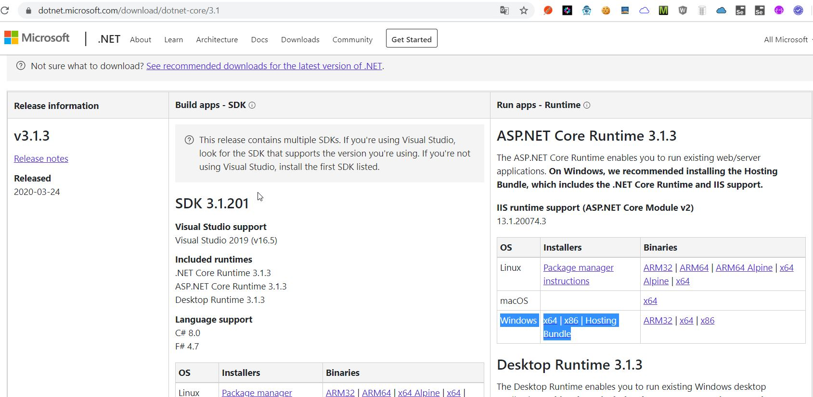
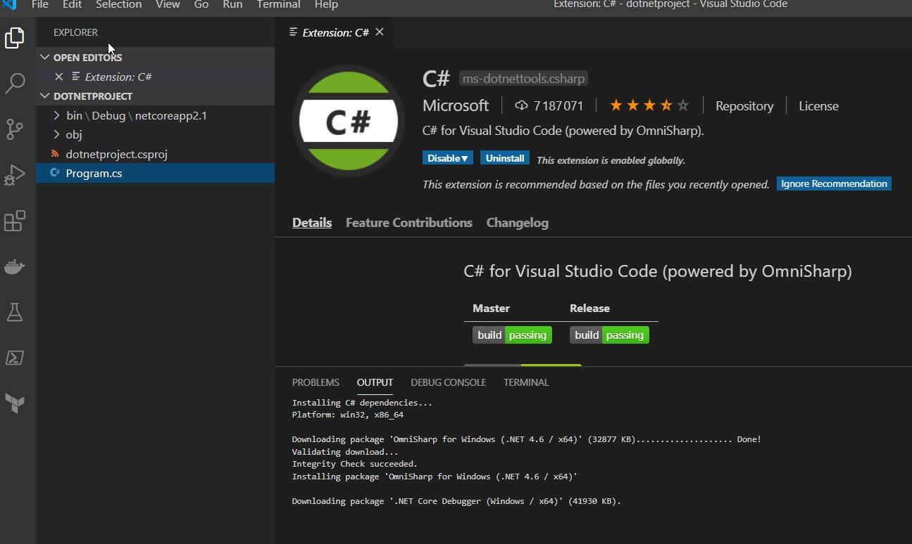
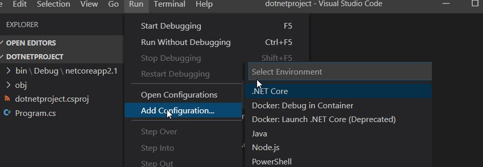
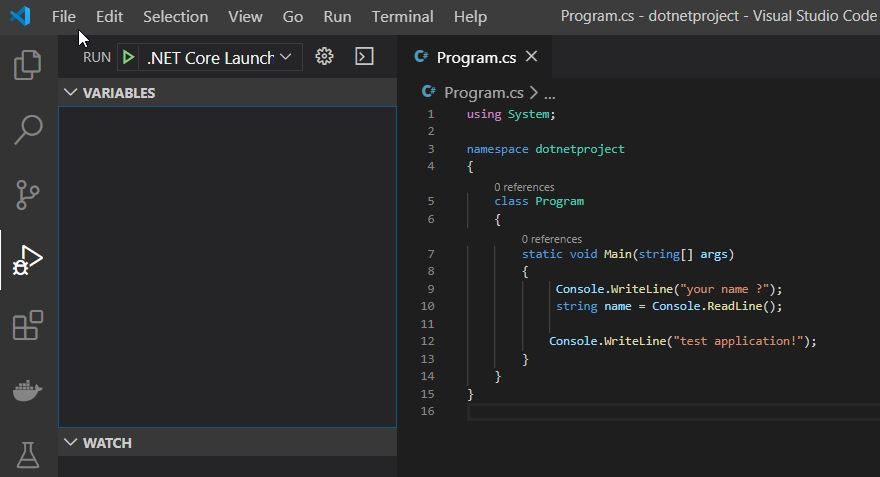

# dotnet core

## installation.
par défaut installé avec visual studio




## creation d'un projet console
```bash
λ dotnet new console
Le modèle 'Console Application' a été créé.

Traitement des actions postcréation...
Exécution de 'dotnet restore' sur C:\PERSONNEL\dot_net_training\dotnetproject\dotnetproject.csproj...
  Restauration des packages pour C:\PERSONNEL\dot_net_training\dotnetproject\dotnetproject.csproj...
  Génération du fichier MSBuild C:\PERSONNEL\dot_net_training\dotnetproject\obj\dotnetproject.csproj.nuget.g.props.
  Génération du fichier MSBuild C:\PERSONNEL\dot_net_training\dotnetproject\obj\dotnetproject.csproj.nuget.g.targets.
  Restauration effectuée dans 387,13 ms pour C:\PERSONNEL\dot_net_training\dotnetproject\dotnetproject.csproj.

Restauration réussie.


C:\PERSONNEL\dot_net_training\dotnetproject
λ dir
 Le volume dans le lecteur C s’appelle OS
 Le numéro de série du volume est 2E66-D7B4

 Répertoire de C:\PERSONNEL\dot_net_training\dotnetproject

13/04/2020  19:48    <DIR>          .
13/04/2020  19:48    <DIR>          ..
13/04/2020  19:48               178 dotnetproject.csproj
13/04/2020  19:48    <DIR>          obj
13/04/2020  19:48               195 Program.cs
               2 fichier(s)              373 octets
               3 Rép(s)  19 163 140 096 octets libres
```


lancer l'applicatoin
````bash
C:\PERSONNEL\dot_net_training\dotnetproject
λ type Program.cs
using System;
namespace dotnetproject
{
    class Program
    {
        static void Main(string[] args)
        {
            Console.WriteLine("Hello World!");
        }
    }
}

C:\PERSONNEL\dot_net_training\dotnetproject
λ dotnet run
Hello World!
````

fichier de dependances microsoft ( equivalent pom.xml de maven)
Microsft fourni un outil pour ajouter directement sans toucher à ce fichier manuellement.
````bash
C:\PERSONNEL\dot_net_training\dotnetproject                
λ type dotnetproject.csproj                                
<Project Sdk="Microsoft.NET.Sdk">                          
                                                           
  <PropertyGroup>                                          
    <OutputType>Exe</OutputType>                           
    <TargetFramework>netcoreapp2.1</TargetFramework>       
  </PropertyGroup>                                         
                                                           
</Project>
 ````


## visual code
Add pluging C# et **add configuratoin dotnet** au projet







debug Csharp avec visual code



